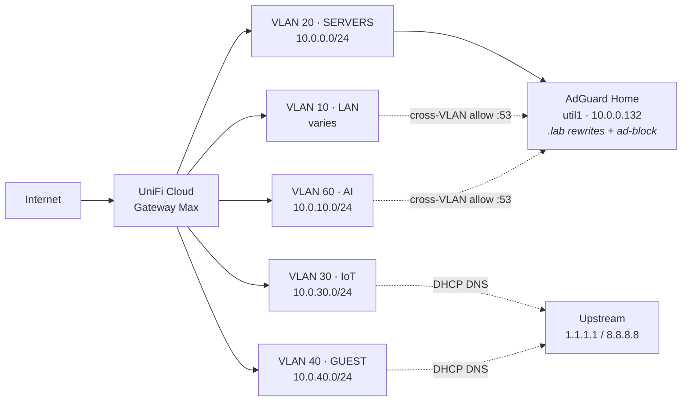

# homelab

> A declarative, portable homelab on three HP EliteDesk mini PCs and a Mac Mini. Terraform provisions the VMs, Ansible configures them, k3s runs the apps, Tailscale handles remote access. Bare metal → live workloads in roughly an afternoon.

## What's inside

- **3× HP EliteDesk** (`prox-1/2/3`) running **Proxmox VE 8** as standalone hosts (no Proxmox cluster — clustering happens at k3s).
- **10 Ubuntu 24.04 VMs** cloned from one cloud-init template, each pinned to a role.
- **k3s** Kubernetes cluster — 1 control plane + 2 workers.
- **Mac Mini** on a separate VLAN for AI workloads (Ollama) + Python research + macOS/iOS builds.
- **UniFi Cloud Gateway Max** + managed switch, VLAN-isolated lab network, completely independent of the home/family Spectrum network.
- **Tailscale** subnet router so the whole lab is reachable from anywhere without exposing a single public port.
- **Self-hosted GitHub Actions runner** so CI runs free, inside the LAN, with direct access to k3s and Postgres.

## What's running

| Layer | Service | Where |
|---|---|---|
| Ingress | Traefik + cert-manager + Let's Encrypt | inside k3s |
| GitOps | Argo CD (app-of-apps pattern) | inside k3s, watches `deploy/argocd-apps/` |
| Database | PostgreSQL 16 | `db1` VM, exposed as `postgres.prod.svc` |
| Observability | Grafana + Prometheus + Loki + node-exporters | `obs1` VM (outside k3s on purpose) |
| Backups | restic + daily `pg_dump` + off-site sync (B2/S3) | `backup1` VM |
| CI | GitHub Actions self-hosted runner | `ci1` VM |
| DNS / Ad-blocking | AdGuard Home | `util1` VM |
| Remote access | Tailscale mesh VPN | `ts-router` VM (subnet router) |
| AI inference | Ollama (local + Ollama Pro cloud-routed) | Mac Mini |
| AI frontend | Open WebUI (ChatGPT-style UI over Ollama) | inside k3s |
| Dashboard | Homepage (gethomepage.dev) | inside k3s, at `home.lab` |

## Dashboard

Homepage (gethomepage.dev) surfaces every service in one place — health checks, links, system stats. Reachable at `http://home.lab` once DNS is wired up. See `deploy/homepage/homepage.yaml` for the tile config and `ansible/utility.yml` for the AdGuard `home.lab` rewrite.

## Documentation

Two short, focused PDFs:

- **[docs/architecture.pdf](docs/architecture.pdf)** — executive overview: system layers, network topology, IP plan, security model, design decisions.
- **[docs/runbook.pdf](docs/runbook.pdf)** — practical "rebuild from scratch + day-to-day maintenance" guide: prerequisites, env vars, commands, what owns what.
- **[docs/ip-plan.md](docs/ip-plan.md)** — the IP / VLAN / DNS pattern the repo uses, with the allocation rule.

## Repo layout

```
homelab/
├── terraform/        VM lifecycle — bpg/proxmox provider, for_each over locals.tf
├── ansible/          Configuration — one playbook per concern
│   ├── base.yml         baseline (TZ, packages, swap off)
│   ├── k3s.yml          1 control plane + 2 workers
│   ├── tailscale.yml    subnet router
│   ├── postgres.yml     Postgres + k8s ExternalName + Secret
│   ├── traefik.yml      ingress + cert-manager + LE issuers
│   ├── backup.yml       restic + daily pg_dump
│   ├── observability.yml Grafana + Prometheus + Loki + node-exporters
│   ├── ci.yml           GitHub Actions self-hosted runner
│   ├── utility.yml      AdGuard Home
│   ├── macmini.yml      Ollama + pyenv + uv on the Mac
│   └── argocd.yml       Argo CD install + app-of-apps bootstrap
├── deploy/           k8s manifests for apps running in the cluster
├── scripts/          one-off host setup (Proxmox bootstrap + cloud-init template)
├── cloud-init/       reusable user-data
└── docs/             architecture.pdf + runbook.pdf + source HTML + diagrams
```

## Quick start (rebuild from scratch)

The full version is in [docs/runbook.pdf](docs/runbook.pdf). The 30-second tour:

```bash
git clone git@github.com:codephilip/homelab.git ~/homelab
cd ~/homelab

# 1. fill in secrets + swap example IPs for yours
cp .envrc.example .envrc      # edit, then:
source .envrc
# Edit terraform/locals.tf and ansible/inventory.yml to match your network.
# See docs/ip-plan.md for the allocation pattern.

# 2. bootstrap each Proxmox host (one-time)
scripts/prox-bootstrap.sh prox-1
scripts/build-template.sh prox-1
# (repeat for prox-2 and prox-3)

# 3. provision all 10 VMs
cd terraform && terraform init && terraform apply -auto-approve

# 4. configure them
cd ../ansible
ansible-galaxy collection install -r requirements.yml
ansible-playbook base.yml k3s.yml tailscale.yml postgres.yml \
                 traefik.yml backup.yml observability.yml \
                 ci.yml utility.yml macmini.yml argocd.yml

# 5. apps are GitOps-managed by Argo CD
#    Argo watches deploy/argocd-apps/ and syncs each child app from deploy/<name>/
export KUBECONFIG=~/homelab/.kube/home.yaml
kubectl -n argocd get applications
curl http://whoami.10.0.0.120.nip.io          # placeholder IP — replace with your k3s-w1 IP
```

## What's not automated

This repo gets VMs running and apps deployed. Your network is your business — bring up whatever subnet/VLANs you like, the IPs in `terraform/locals.tf` and `ansible/inventory.yml` are just examples. The short list of out-of-band steps:

- **DNS for `.lab` hostnames.** `ansible/utility.yml` installs AdGuard on `util1` and `adguard-rewrites.yml` loads the rewrites, but you still need to:
  - run the AdGuard first-boot wizard (browser, set admin password)
  - point your gateway's DHCP to hand out `util1`'s IP as DNS
  - (optional) add a Tailscale split-DNS rule so `.lab` resolves off-LAN
- **Tailscale.** Pre-auth key into `.envrc` as `TAILSCALE_AUTHKEY`; the subnet route still needs one-time approval in the admin console.
- **Public domains.** Internet-facing apps need a real domain at your registrar, a port-forward for 80/443 on your gateway, and the hostname added to the relevant Traefik IngressRoute. cert-manager handles the cert.
- **Mac Mini Tailscale.** Install the cask by hand once (interactive sudo); ansible does the rest.
- **GitHub Actions runner.** Drop a PAT with repo admin into `GITHUB_TOKEN` so `ansible/ci.yml` can fetch a registration token.

Everything else is `terraform apply` + `ansible-playbook`.

## Design principles

- **Declarative wherever possible.** If it can be code, it is — Terraform for VMs, Ansible for config, k8s manifests for apps. Out-of-band steps (Proxmox install, browser wizards) are documented and few.
- **One source of truth for the IP plan.** `terraform/locals.tf`. Hosts are at `.10N`, VMs on `prox-N` live in `.1N0–.1N9`. Memorizable in one sentence.
- **Standalone Proxmox, clustered k3s.** No corosync, no shared storage, no Proxmox HA. The cluster lives where workloads need it.
- **Tailscale for everything internal.** Only the small number of services that need to be public get a forwarded port. Everything else is unreachable from the open internet.
- **Backups assume the worst.** Encrypted (restic), versioned, off-site, with a restore drill cadence in the runbook.
- **Portable.** Unplug the whole rack, plug it into Airbnb Wi-Fi, same IPs, same apps. The UniFi gateway abstracts the upstream away.

## Network

Two parallel networks behind one upstream uplink. The home network (untouched) runs family devices and IoT. The lab network (UniFi) is fully isolated, VLAN-segmented, and portable. Double-NAT is a deliberate trade for separation + portability — Tailscale erases the operational pain.

### IP / VLAN map



| VLAN | Name | Subnet (example) | DHCP DNS | Used for |
|---|---|---|---|---|
| 10 | LAN | varies | AdGuard (`util1`) | Personal devices — laptop, phone |
| 20 | SERVERS | `10.0.0.0/24` | AdGuard (`util1`) | Proxmox hosts + lab VMs |
| 30 | IoT | `10.0.30.0/24` | upstream | Lab-side IoT (isolated from SERVERS) |
| 40 | GUEST | `10.0.40.0/24` | upstream | Visitors (internet only) |
| 60 | AI | `10.0.10.0/24` | AdGuard (`util1`) | Mac Mini + future AI gear |

**VLAN 10, 20, and 60** all hand out AdGuard's IP as DNS via DHCP — that's what makes `.lab` shortcuts resolve from any device on those segments. The gateway has a cross-VLAN firewall rule allowing `:53` from 10 / 60 into 20 so the query reaches `util1`. **IoT and GUEST** stay on upstream DNS for isolation — neither can resolve nor reach `.lab` hosts on SERVERS.

See [docs/ip-plan.md](docs/ip-plan.md) for the host-level allocation rule (`.10N` for Proxmox hosts, `.1N0–.1N9` for VMs).

## Stack

| | |
|---|---|
| Hypervisor | Proxmox VE 8 |
| OS | Ubuntu Server 24.04 LTS |
| Cluster | k3s 1.30 |
| Provisioning | Terraform (`bpg/proxmox`) |
| Configuration | Ansible |
| Ingress | Traefik |
| TLS | cert-manager + Let's Encrypt |
| Database | PostgreSQL 16 |
| Observability | Grafana, Prometheus, Loki, node-exporter |
| Backup | restic + rclone |
| VPN | Tailscale |
| DNS | AdGuard Home |
| GitOps | Argo CD |
| Dashboard | Homepage (gethomepage.dev) |
| CI | GitHub Actions (self-hosted runner) |
| AI | Ollama (local + cloud-routed) + Open WebUI |

## License

Personal homelab — no warranty, no support. Steal whatever's useful.
